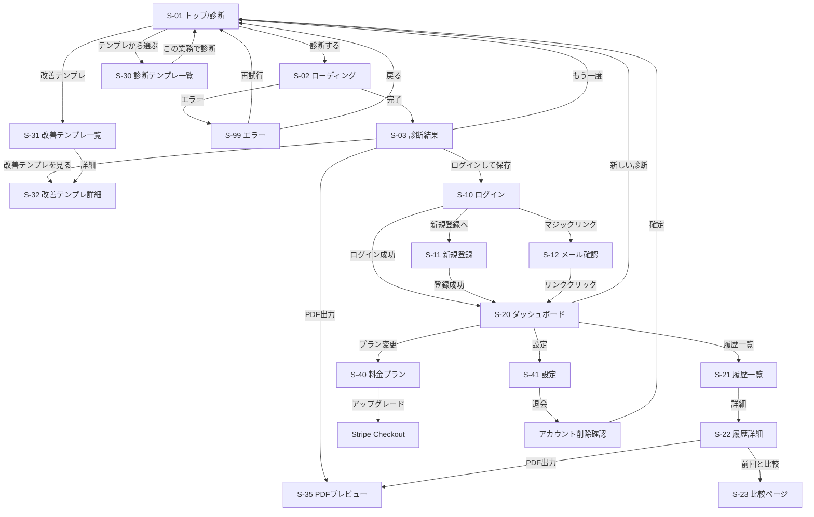

# flow_v2.md - SaaS版 画面設計・画面遷移

## 1. 画面一覧

### 共通

| # | 画面名 | URLパス | 認証 | 説明 |
|---|-------|---------|------|------|
| S-00 | グローバルヘッダー | - | - | ロゴ・ナビ・ユーザーメニュー（全画面共通） |
| S-99 | エラーページ | `/error` | 不要 | エラー表示 + 再試行/戻るボタン |

### 認証系

| # | 画面名 | URLパス | 認証 | 説明 |
|---|-------|---------|------|------|
| S-10 | ログインページ | `/login` | 不要 | メール+PW / マジックリンク / Google |
| S-11 | 新規登録ページ | `/register` | 不要 | アカウント作成フォーム |
| S-12 | マジックリンク送信完了 | `/login/check-email` | 不要 | 「メールを確認してください」|

### 診断系（v1拡張）

| # | 画面名 | URLパス | 認証 | 説明 |
|---|-------|---------|------|------|
| S-01 | トップ / 診断ページ | `/` | 不要 | 入力フォーム + テンプレ導線 |
| S-02 | 診断中 | - | - | ローディングオーバーレイ |
| S-03 | 診断結果 | `/result/[id]` | 不要 | 結果 + 前回比較 + 改善テンプレリンク |

### ダッシュボード系

| # | 画面名 | URLパス | 認証 | 説明 |
|---|-------|---------|------|------|
| S-20 | ダッシュボード | `/dashboard` | 必要 | 改善スコア推移 + 統計 + 最近の診断 |
| S-21 | 診断履歴一覧 | `/dashboard/history` | 必要 | 履歴テーブル + ページネーション |
| S-22 | 履歴詳細 | `/dashboard/history/[id]` | 必要 | 結果再表示 + 前回比較 |
| S-23 | 前回比較ページ | `/dashboard/compare/[id]` | 必要 | 2回分の結果を並べて比較 |

### テンプレート系

| # | 画面名 | URLパス | 認証 | 説明 |
|---|-------|---------|------|------|
| S-30 | 業種別診断テンプレート一覧 | `/templates` | 不要 | 業種別の業務リストテンプレ |
| S-31 | 改善テンプレートライブラリ | `/templates/improvement` | 不要 | AI化/IT化の改善施策テンプレ集 |
| S-32 | 改善テンプレート詳細 | `/templates/improvement/[id]` | 不要 | 具体的な手順・ツール推薦 |

### レポート系

| # | 画面名 | URLパス | 認証 | 説明 |
|---|-------|---------|------|------|
| S-35 | PDFプレビュー | `/report/[id]` | 必要 | PDFのWeb上プレビュー + DLボタン |

### 課金・設定系

| # | 画面名 | URLパス | 認証 | 説明 |
|---|-------|---------|------|------|
| S-40 | 料金プランページ | `/pricing` | 不要 | Free / Pro / Consultant 比較 + FAQ |
| S-41 | アカウント設定 | `/settings` | 必要 | プロフィール・プラン管理・退会 |

---

## 2. 画面遷移図（Mermaid）



---

## 3. グローバルヘッダー (S-00)

### 未ログイン時
```
┌────────────────────────────────────────────────────────────┐
│ AI業務棚卸し  [診断] [テンプレート] [改善ライブラリ] [料金]  [ログイン] │
└────────────────────────────────────────────────────────────┘
```

### ログイン時
```
┌────────────────────────────────────────────────────────────────┐
│ AI業務棚卸し  [診断] [テンプレート] [改善ライブラリ] [ダッシュボード]  [👤 ▼] │
│                                                ┌──────────────┐  │
│                                                │ 設定          │  │
│                                                │ プラン: Pro   │  │
│                                                │ 残り: 無制限  │  │
│                                                │ ログアウト    │  │
│                                                └──────────────┘  │
└────────────────────────────────────────────────────────────────┘
```

### モバイル（ハンバーガー展開時）
```
┌─────────────────────────────┐
│ AI業務棚卸し            [×]  │
├─────────────────────────────┤
│  診断する                    │
│  テンプレート                │
│  改善ライブラリ              │
│  ダッシュボード              │
│  料金プラン                  │
│  ─────────                  │
│  アカウント設定              │
│  プラン: Free (残り2回)      │
│  ログアウト                  │
└─────────────────────────────┘
```

---

## 4. 各画面ワイヤーフレーム

### S-99 エラーページ

```
┌──────────────────────────────────────────┐
│ [ヘッダー]                                │
├──────────────────────────────────────────┤
│                                          │
│              ⚠ エラーが発生しました         │
│                                          │
│     AI診断中にエラーが発生しました。          │
│     しばらく経ってから再試行してください。     │
│                                          │
│     エラーコード: 502                       │
│                                          │
│     [ 再試行する ]  [ トップに戻る ]         │
│                                          │
│     解決しない場合はサポートまで              │
│     お問い合わせください。                   │
│                                          │
└──────────────────────────────────────────┘
```

### S-10 ログインページ

```
┌──────────────────────────────────────────┐
│ [ヘッダー]                                │
├──────────────────────────────────────────┤
│                                          │
│  ┌────────────────────────────────┐      │
│  │       ログイン                  │      │
│  │                                │      │
│  │  [ G Googleでログイン ]         │      │
│  │                                │      │
│  │  ─── または ───                 │      │
│  │                                │      │
│  │  メールアドレス                  │      │
│  │  [                           ] │      │
│  │                                │      │
│  │  パスワード                     │      │
│  │  [                           ] │      │
│  │                                │      │
│  │  [ ログイン ]                   │      │
│  │                                │      │
│  │  [ マジックリンクで            ]│      │
│  │  [ ログイン（パスワード不要）   ]│      │
│  │                                │      │
│  │  アカウントをお持ちでない方はこちら │    │
│  └────────────────────────────────┘      │
└──────────────────────────────────────────┘
```

### S-03 診断結果ページ（v2拡張：前回比較 + 改善テンプレ）

```
┌──────────────────────────────────────────────┐
│ [ヘッダー]                                     │
├──────────────────────────────────────────────┤
│                                              │
│  診断結果  部署: 営業部  2026/3/4              │
│                                              │
│  ┌─ サマリー ─────────────────────────┐       │
│  │ (円グラフ)  AI化:2  IT化:2  人:1    │       │
│  └────────────────────────────────────┘       │
│                                              │
│  ┌─ 前回比較（ログイン+Pro以上）───────┐       │
│  │  前回(2/15)      今回(3/4)         │       │
│  │  AI化+IT化: 50%  → AI化+IT化: 70%  │       │
│  │                                    │       │
│  │  改善率: ↑ +20ポイント 🎉           │       │
│  │                                    │       │
│  │  変化した業務:                      │       │
│  │  ・問合せ対応: 人→IT化 ✓            │       │
│  │  ・在庫管理: IT化→AI化 ✓            │       │
│  │  [詳しい比較を見る]                  │       │
│  └────────────────────────────────────┘       │
│                                              │
│  ┌─ 結果テーブル ─────────────────────┐       │
│  │ 業務名  │ 分類  │確信度│ 改善テンプレ  │      │
│  │ 請求書  │ AI化  │ 90%│ [テンプレを見る]│      │
│  │ 問合せ  │ IT化  │ 75%│ [テンプレを見る]│      │
│  │ 商談    │ 人    │ 85%│  -            │      │
│  └─────────────────────────────────────┘      │
│  ※ 行をクリックで詳細展開                       │
│                                              │
│  [CSV出力] [PDF出力(Pro)] [もう一度診断する]     │
│                                              │
│  ┌─ 未ログイン時 ───────────────────┐          │
│  │ ログインすると結果を保存・比較できます │        │
│  │ [ ログインして保存 ] [ 新規登録 ]   │          │
│  └───────────────────────────────────┘        │
└──────────────────────────────────────────────┘
```

### S-20 ダッシュボード

```
┌──────────────────────────────────────────────┐
│ [ヘッダー]                                     │
├──────────────────────────────────────────────┤
│                                              │
│  ダッシュボード                                 │
│                                              │
│  ┌─── 利用状況 ─────────────────────────┐     │
│  │ プラン: Pro     今月: 12回 / 無制限   │     │
│  │ [プランを変更する]                    │     │
│  └──────────────────────────────────────┘     │
│                                              │
│  ┌─── 改善スコア ──────────────────────┐      │
│  │                                     │      │
│  │  現在の自動化可能率: 68%             │      │
│  │  初回からの改善: ↑ +23ポイント       │      │
│  │                                     │      │
│  │  (折れ線グラフ: 月別の自動化可能率推移) │     │
│  │  1月: 45%  2月: 55%  3月: 68%       │      │
│  └──────────────────────────────────────┘     │
│                                              │
│  ┌─── 累計統計 ────────────────────────┐      │
│  │  診断回数: 12回  業務分析数: 87件     │      │
│  │  AI化: 35% │ IT化: 40% │ 人: 25%   │      │
│  └──────────────────────────────────────┘     │
│                                              │
│  ┌─── 最近の診断 ─────────────────────┐      │
│  │ 日付    │ 部署   │件数│改善率│ 操作  │      │
│  │ 3/4    │ 営業部 │ 5 │+20pt│[詳細] │      │
│  │ 2/15   │ 営業部 │ 5 │ -   │[詳細] │      │
│  │ 2/1    │ 総務部 │ 8 │ -   │[詳細] │      │
│  │         [すべての履歴を見る]          │      │
│  └──────────────────────────────────────┘     │
│                                              │
│  [ 新しい診断を始める ]                         │
└──────────────────────────────────────────────┘
```

### S-23 前回比較ページ

```
┌──────────────────────────────────────────────┐
│ [ヘッダー]                                     │
├──────────────────────────────────────────────┤
│                                              │
│  診断比較: 営業部                                │
│                                              │
│  ┌─── 改善率 ────────────────────────┐        │
│  │         ↑ +20 ポイント             │        │
│  │   自動化可能率: 50% → 70%          │        │
│  └────────────────────────────────────┘       │
│                                              │
│  ┌─ 前回 (2/15) ──┐  ┌─ 今回 (3/4) ──┐      │
│  │  (円グラフ)      │  │  (円グラフ)     │      │
│  │  AI化: 1件(20%) │  │  AI化: 2件(40%)│      │
│  │  IT化: 2件(40%) │  │  IT化: 2件(40%)│      │
│  │  人:  2件(40%) │  │  人:  1件(20%)│      │
│  └────────────────┘  └────────────────┘      │
│                                              │
│  ┌─ 業務ごとの変化 ──────────────────┐        │
│  │ 業務名    │ 前回  │ 今回  │ 変化   │        │
│  │ 問合せ対応│ 人    │ IT化  │ ✓ 改善 │        │
│  │ 在庫管理  │ IT化  │ AI化  │ ✓ 改善 │        │
│  │ 請求書    │ AI化  │ AI化  │ → 維持 │        │
│  │ 顧客管理  │ IT化  │ IT化  │ → 維持 │        │
│  │ 商談      │ 人    │ 人    │ → 維持 │        │
│  └──────────────────────────────────┘        │
│                                              │
│  [ PDF出力 ]  [ ダッシュボードに戻る ]            │
└──────────────────────────────────────────────┘
```

### S-31 改善テンプレートライブラリ

```
┌──────────────────────────────────────────────┐
│ [ヘッダー]                                     │
├──────────────────────────────────────────────┤
│                                              │
│  改善テンプレートライブラリ                        │
│  AI化・IT化と判定された業務の具体的な改善方法       │
│                                              │
│  [AI化テンプレ] [IT化テンプレ]  ← タブ切替        │
│                                              │
│  ┌─ メール返信の自動化 ──┐  ┌─ FAQ自動生成 ─┐  │
│  │ カテゴリ: AI化         │  │ カテゴリ: AI化 │  │
│  │ 削減時間: 月10時間     │  │ 削減: 月8時間  │  │
│  │ ツール: ChatGPT,      │  │ ツール: Notion │  │
│  │         Claude        │  │  AI, Zendesk  │  │
│  │ [詳しく見る]           │  │ [詳しく見る]   │  │
│  └───────────────────────┘  └───────────────┘  │
│                                              │
│  ┌─ 議事録の自動作成 ────┐  ┌─ 🔒 レポート ─┐  │
│  │ カテゴリ: AI化         │  │ Proプランで    │  │
│  │ 削減時間: 月5時間      │  │ 利用可能      │  │
│  │ ツール: otter.ai,     │  │               │  │
│  │         CLOVA Note    │  │ [アップグレード]│  │
│  │ [詳しく見る]           │  │               │  │
│  └───────────────────────┘  └───────────────┘  │
└──────────────────────────────────────────────┘
```

### S-32 改善テンプレート詳細

```
┌──────────────────────────────────────────────┐
│ [ヘッダー]                                     │
├──────────────────────────────────────────────┤
│                                              │
│  ← テンプレート一覧に戻る                       │
│                                              │
│  メール返信の自動化                              │
│  カテゴリ: AI化  想定削減: 月10時間               │
│                                              │
│  ┌─ 概要 ────────────────────────────┐        │
│  │ 定型的なメール返信をAIで自動化。      │        │
│  │ 問い合わせの80%は定型回答で対応可能。  │        │
│  └────────────────────────────────────┘       │
│                                              │
│  ┌─ 推薦ツール ──────────────────────┐        │
│  │ 1. ChatGPT Team - ¥3,400/月/人   │        │
│  │ 2. Claude Pro - ¥3,000/月/人      │        │
│  │ 3. Gemini Advanced - ¥2,900/月/人 │        │
│  └────────────────────────────────────┘       │
│                                              │
│  ┌─ 導入ステップ ────────────────────┐        │
│  │ Step1. 過去1ヶ月のメールを分類      │        │
│  │ Step2. 定型パターンを5つ特定        │        │
│  │ Step3. AIプロンプトのテンプレを作成  │        │
│  │ Step4. 1週間テスト運用             │        │
│  │ Step5. 全員に展開                  │        │
│  └────────────────────────────────────┘       │
│                                              │
│  ┌─ 注意点 ──────────────────────────┐        │
│  │ ・機密情報を含むメールは除外する     │        │
│  │ ・生成結果は必ず人がチェックする     │        │
│  └────────────────────────────────────┘       │
│                                              │
│  [ この業務を診断してみる ]                       │
└──────────────────────────────────────────────┘
```

### S-35 PDFプレビュー

```
┌──────────────────────────────────────────────┐
│ [ヘッダー]                                     │
├──────────────────────────────────────────────┤
│                                              │
│  PDFレポートプレビュー                           │
│                                              │
│  会社名（任意）: [                          ]   │
│  レポートタイトル: [業務DX診断レポート       ]     │
│                                              │
│  ┌─ プレビュー ──────────────────────┐        │
│  │ ┌────────────────────────┐       │        │
│  │ │    業務DX診断レポート     │       │        │
│  │ │    株式会社○○            │       │        │
│  │ │    営業部               │       │        │
│  │ │    2026年3月4日          │       │        │
│  │ ├────────────────────────┤       │        │
│  │ │    (サマリー)            │       │        │
│  │ │    (前回比較)            │       │        │
│  │ │    (結果テーブル)        │       │        │
│  │ └────────────────────────┘       │        │
│  └────────────────────────────────────┘       │
│                                              │
│  [ PDFをダウンロード ]                           │
│                                              │
└──────────────────────────────────────────────┘
```

### S-40 料金プランページ

```
┌──────────────────────────────────────────────┐
│ [ヘッダー]                                     │
├──────────────────────────────────────────────┤
│                                              │
│   業務改善を、もっと本格的に。                     │
│                                              │
│  ┌─ Free ──┐ ┌─ Pro ─────┐ ┌─ Consultant ─┐│
│  │ ¥0      │ │ ¥9,800/月 │ │ ¥29,800/月   ││
│  │         │ │ おすすめ   │ │              ││
│  │ 5回/月   │ │ 無制限    │ │ 無制限       ││
│  │ 10件/回  │ │ 50件/回   │ │ 100件/回     ││
│  │ 履歴3件  │ │ 履歴無制限 │ │ 履歴無制限   ││
│  │ CSV     │ │ CSV+PDF   │ │ CSV+PDF+API  ││
│  │ テンプレ3│ │ テンプレ全 │ │ +カスタム登録 ││
│  │ -       │ │ 前回比較   │ │ 部門横断比較  ││
│  │ -       │ │ 3名まで   │ │ 20名まで     ││
│  │         │ │           │ │ ホワイトラベル ││
│  │[現在]    │ │[14日間    │ │[お問い合わせ] ││
│  │         │ │ 無料体験] │ │              ││
│  └─────────┘ └───────────┘ └──────────────┘│
│                                              │
│  ┌─ よくある質問 ──────────────────────┐      │
│  │ ▶ 途中でプランを変更できますか？      │      │
│  │ ▶ 解約したらデータはどうなりますか？    │      │
│  │ ▶ 無料トライアルに支払い情報は必要？   │      │
│  │ ▶ チームメンバーの追加方法は？         │      │
│  └──────────────────────────────────────┘     │
└──────────────────────────────────────────────┘
```

---

## 5. ユーザー動線

### 5.1 新規ユーザー（未ログイン → 体験 → 登録 → 定着）

```
1. トップページにアクセス（広告/SEO/紹介）
2. テンプレートから業務を選ぶ or 手入力
3. 「診断する」→ 結果を確認 → 改善テンプレを見る
4. 「ログインすると保存できます」で登録を促進
5. 新規登録（Google or メール）
6. 直前の診断結果が自動保存
7. ダッシュボードで改善スコアの起点を確認
8. 2回目以降の診断で「前回比較」が有効化 → 継続動機
```

### 5.2 Proユーザー（日常利用 → 社内共有）

```
1. ダッシュボードで改善スコア推移を確認
2. 「新しい診断を始める」→ 別部署の業務を入力
3. 結果を確認 → 前回比較で改善率を確認
4. PDFレポートをダウンロード → 経営会議で共有
5. 改善テンプレートを見て具体的な施策を検討
6. 翌月に再診断 → 改善の進捗をトラッキング
```

### 5.3 Consultantユーザー（複数クライアント対応）

```
1. クライアントAの部署ごとに診断を実行
2. 部門横断の比較ダッシュボードで全社傾向を把握
3. ホワイトラベルPDFでクライアント向け報告書を出力
4. 独自の改善テンプレートを登録
5. 月次で再診断 → 改善率を定量的に報告
```

---

## 6. 異常系・分岐

| 状況 | 挙動 |
|------|------|
| 未ログインで診断後に登録 | 直前の診断結果を自動でアカウントに紐付け保存 |
| 月間診断回数超過(Free) | 診断ボタン非活性 + アップグレード導線 |
| FreeでPDF出力タップ | モーダル「Proプランの機能です」+ サンプルPDFプレビュー |
| Freeで前回比較タップ | モーダル「Proプランで利用可能です」+ 比較サンプル画像 |
| API通信エラー | S-99 エラーページに遷移 + 再試行/戻るボタン |
| AI応答がJSON不正 | S-99「診断できませんでした」+ 再試行ボタン |
| 認証トークン切れ | ログインページにリダイレクト + リダイレクト先を保持 |
| セッション切れ中に診断 | 結果表示するが保存不可 + ログイン促進 |
| アカウント削除 | 「削除」入力 + パスワード入力の2段階確認 |
| 履歴削除 | 確認ダイアログ + 「元に戻せません」メッセージ |
| マジックリンク期限切れ | 「リンクの有効期限が切れました」+ 再送信ボタン |
